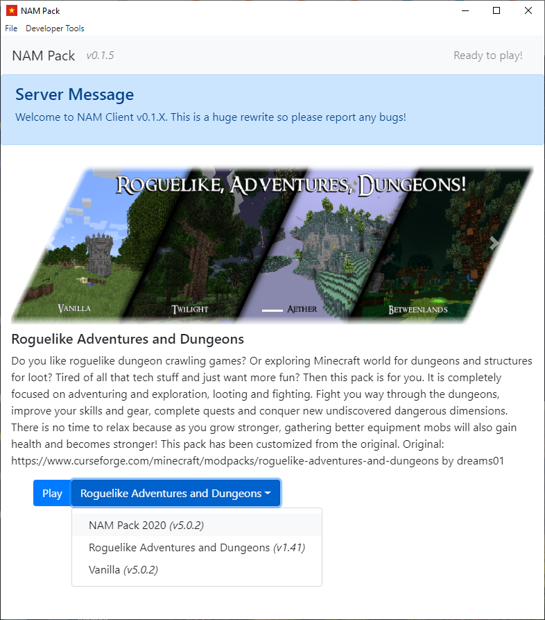

# NAM Pack

*Not Another Minecraft Pack is a collection of mods based on building on top of vanilla minecraft.*

# About

The goal of NAM Pack is to be able to update minecraft modpacks in the NAM Pack collection.
This program builds upon [MultiMC](https://multimc.org/), using it as a backend, handling authentication, downloading, and launching Minecraft.

## Features
  - Package Resolution
  - Auto Updating Custom Modpacks
  - Allow for Server Status Notifications before Launching the Game 
  - Select Different Modpacks

# Installation

Download at the [official website](https://borisliao.github.io/NAM-Pack/)